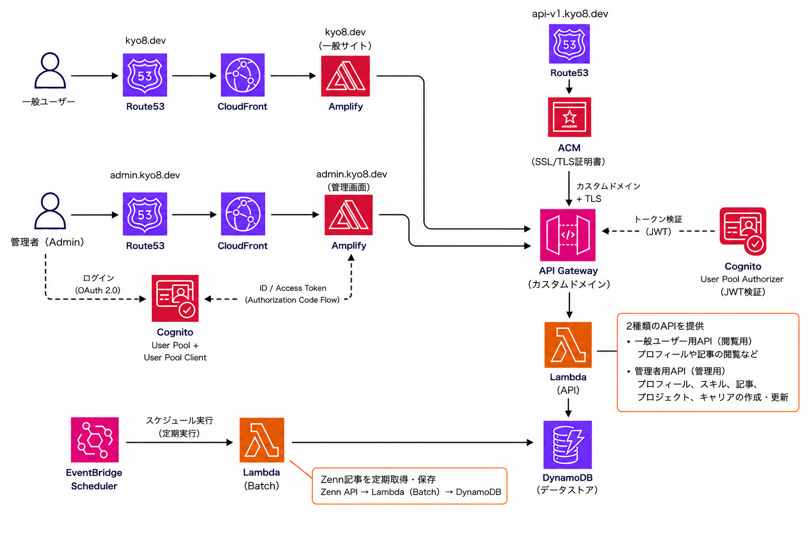
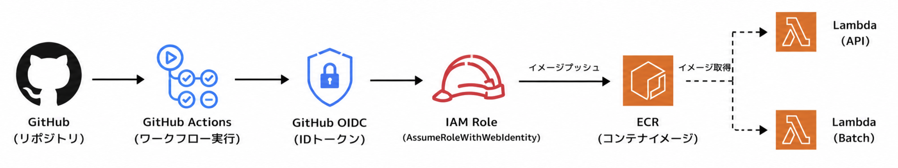

# kyo8-portfolio
ポートフォリオサイトです。公開サイトと管理画面を同一リポジトリで管理するモノレポ構成です。
※テストコード作成中です。

# 目次
- [リポジトリ構成](#リポジトリ構成)
- [AWSアーキテクチャ](#aws-アーキテクチャ)
- [Terraform](#terraform)
- [DynamoDB構成](#dynamodb構成)
- [APIルーティング](#apiルーティング)
- [Cognito認証フロー](#cognito-認証フロー)
- [デプロイ](#デプロイ)
- [バッチ同期](#バッチ同期)
- [エラーハンドリング](#エラーハンドリング)
- [テスト](#テスト)

# リポジトリ構成

`````text
kyo8-portfolio/
├── apps/
│   ├── web/       # 公開用 Next.js
│   ├── admin/     # 管理用 Next.js
│   └── api/       # Go API / Lambda
├── infra/
│   ├── stg/       # ステージング環境
│   ├── prd/       # 本番環境
│   └── modules/   # Terraformモジュール
└── .github/
    └── workflows/ # CI/CD
`````

`apps/web`と`apps/admin`はNext.jsのフロントエンドです。共通コンポーネントはnpm workspacesで管理しています。

`apps/api`はGoで書かれたAPIで、LambdaコンテナとしてECRにデプロイされます。

# AWSアーキテクチャ



# Terraform

環境ごとに`stg`と`prd`を分離し、TerraformのstateをS3バケットで環境別に管理します。

## 主な管理対象：

- ECR
- Lambda
- API Gateway
- DynamoDB
- Cognito 
- EventBridge Scheduler
- ACM certificates
- Route53

# DynamoDB構成

環境ごとに`profile`、`skill`、`article`、`project`、`career`の5テーブルを作成します。すべてのテーブルで`id`をパーティションキーにしています。

`````mermaid
flowchart TB
    DB[DynamoDB]

    DB --> P["profile-${env}"]
    P --> P1["アイテム 1件<br/>id = profile<br/>プロフィール全体"]

    DB --> S["skill-${env}"]
    S --> S1["アイテム 1件<br/>id = skills<br/>スキル一覧全体"]

    DB --> A["article-${env}"]
    A --> A1["複数アイテム<br/>id = a1, a2, ...<br/>記事ごとに1件"]

    DB --> PR["project-${env}"]
    PR --> PR1["複数アイテム<br/>id = p1, p2, ...<br/>プロジェクトごとに1件"]

    DB --> C["career-${env}"]
    C --> C1["複数アイテム<br/>id = c1, c2, ...<br/>経歴ごとに1件"]
`````

ProfileとSkillは固定の`id`を使って1件のアイテムに全データを保存します。Article、Project、Careerはデータごとに異なる`id`を持つアイテムを複数保存します。一覧取得では`Scan`、個別取得では`GetItem`を使用します。

# APIルーティング
## Public API
```text
GET /{proxy+}
└── Lambda API
```
一般ユーザー向けのAPIは、`/{proxy+}`配下にまとめます。書き込み操作はありません。

## Admin API
```text
OPTIONS /admin/{proxy+} # CORS preflight、認証なし
POST   /admin/{proxy+}  # Cognito認証
PUT    /admin/{proxy+}  # Cognito認証
DELETE /admin/{proxy+}  # Cognito認証
```
管理APIは`/admin/{proxy+}`配下にまとめ、書き込み操作にCognito認証を要求します。OPTIONSリクエストはCORS preflight用で、認証なしで許可します。

# Cognito認証フロー

管理画面は、ブラウザだけで完結するSPA向けAuthorization Code Flow with PKCEを使用します。Cognito App ClientにはClient Secretを設定しません。

`````mermaid
sequenceDiagram
    participant B as Browser
    participant A as Admin App
    participant C as Cognito Hosted UI
    participant API as API Gateway

    B->>A: Login with Cognito
    A->>A: code_verifier / stateを生成
    A->>C: /oauth2/authorize?code_challenge=...
    C-->>B: ログイン画面
    B->>C: パスキー等で認証
    C-->>A: /callback?code=...&state=...
    A->>A: stateを検証し、code_verifierを取得
    A->>C: POST /oauth2/token<br/>code + code_verifier
    C-->>A: ID token / Access token / Refresh token
    A->>A: sessionStorageへ保存
    A->>API: Authorization: Bearer <ID token>
    API->>C: Cognito authorizerでトークン検証
    C-->>API: 検証結果
    API-->>A: 管理APIのレスポンス
    alt APIが401を返す
        A->>C: POST /oauth2/token<br/>refresh_token
        alt トークン更新に成功
            C-->>A: 新しいID token / Access token
            A->>A: 新しいトークンをsessionStorageへ保存
            A->>API: 同じリクエストを新しいID tokenで1回だけ再試行
            API->>C: Cognito authorizerでトークン検証
            API-->>A: APIレスポンス
        else Refresh tokenが期限切れ・無効
            C-->>A: 更新失敗
            A->>A: トークンを削除
            A-->>B: ログイン画面へ遷移
        end
    end
`````

実装上のポイント：

- 認可コードのトークン交換はブラウザからCognitoへ直接行う
- `code_verifier`はブラウザから送信し、PKCEで認可コードを保護する
- APIリクエストではID tokenを`Authorization`ヘッダーへ付与し、API GatewayのCognito authorizerで認証を行う。なお、このプロジェクトではOAuthスコープを設定していないためID tokenを使用している（[AWS公式ドキュメント](https://docs.aws.amazon.com/apigateway/latest/developerguide/apigateway-integrate-with-cognito.html)）。
- トークンの保存先は`sessionStorage`
- ID tokenの期限切れ時は、保存したRefresh tokenでトークンを更新する
- `/admin/*`の書き込みはAPI GatewayのCognito User Pools authorizerで保護する

# デプロイ

## フロントエンド

`apps/web`と`apps/admin`はAWS Amplifyでデプロイします。Amplifyの環境変数にAPI URLやCognito設定を指定します。

## バックエンド

GitHub Actionsが`apps/api`をDocker buildし、ARM64用のLambdaコンテナイメージとしてECRへpushします。その後、API用とBatch用のLambda関数を同じイメージから更新します。



`apps/api/Dockerfile`では、APIとBatchの2つのGoバイナリを1つのコンテナイメージへ配置します。Lambdaごとに起動するコマンドを切り替えます。

```text
/var/task/api    # API Lambda
/var/task/batch  # Batch Lambda
```

# バッチ同期

EventBridge SchedulerがBatch Lambdaを定期実行し、ZennのRSSを取得して記事データをDynamoDBへ保存します。Batch LambdaはAPI Gatewayから公開するエンドポイントを持ちません。

`````mermaid
sequenceDiagram
    participant S as EventBridge Scheduler
    participant L as Lambda Batch
    participant Z as Zenn RSS
    participant D as DynamoDB

    S->>L: 定期的に起動
    L->>Z: RSSフィードを取得
    Z-->>L: 記事一覧・OGP画像URL
    L->>L: 記事データを変換
    L->>D: articleテーブルへ保存
    D-->>L: 保存結果
`````

# エラーハンドリング

アプリケーション固有のエラーは`apps/api/internal/apperrors`で管理します。

エラー処理の責務は次のように分けています。

- Repository：DynamoDB SDKのエラーを`apperrors`へ変換する
- Service：Repositoryから返されたエラーをそのまま上位へ返す
- Handler：`apperrors.ErrorHandler`でHTTPステータスとJSONレスポンスへ変換する

Repositoryでは、DynamoDB固有のエラーとデータ変換エラーを分類します。共通の分類処理は`apps/api/internal/repository/dynamo_error.go`にあります。

主なエラーコードとHTTPステータスは次の通りです。

| コード | HTTPステータス |
| --- | --- |
| `D001` DependencyUnavailable | 503 Service Unavailable |
| `D002` DependencyAuthFailed | 500 Internal Server Error |
| `D003` DependencyConfigError | 500 Internal Server Error |
| `D004` DependencyThrottled | 503 Service Unavailable |
| `D005` Timeout | 504 Gateway Timeout |
| `D006` DataMappingFailed | 500 Internal Server Error |
| `D007` ExternalServiceFailed | 502 Bad Gateway |
| `R001` BadParam | 400 Bad Request |
| `R002` ReqBodyDecodeFailed | 400 Bad Request |
| `R003` ResponseEncodeFailed | 500 Internal Server Error |
| `R004` NotFound | 404 Not Found |
| `R005` RequestBodyTooLarge | 400 Bad Request |

HTTPステータスコードはレスポンスヘッダーで返し、エラーコードとメッセージはレスポンスボディで返します。内部のDynamoDBエラー詳細はクライアントへ返さず、CloudWatchのログにのみ記録します。

例えば、DynamoDBがスロットリングされた場合は次のようになります。

### クライアントへのレスポンス：

`````text
HTTP/1.1 503 Service Unavailable
Content-Type: application/json; charset=utf-8

{"ErrCode":"D004","Message":"temporarily unavailable"}
`````

### CloudWatchへのログ：

`````json
{
  "level": "ERROR",
  "msg": "error occurred",
  "error code": "D004",
  "method": "GET",
  "path": "/profile",
  "status": 503,
  "message": "temporarily unavailable",
  "cause": "ProvisionedThroughputExceededException: ..."
}
`````

クライアントには安全なエラーコードとメッセージだけを返し、CloudWatchには調査に必要なHTTPリクエスト情報と元エラーを記録します。

# テスト

エラー情報は層ごとに検証する範囲を分けている。

| 対象 | 検証する責務 |
|---|---|
| `apperrors`テスト | `Error.Err`が元エラーとして保持されること、JSONレスポンスへ公開されないこと |
| Repositoryテスト | 元のDynamoDBエラーが適切なアプリケーションエラーコードへ分類されること |
| Handlerテスト | エラーが`ErrCode`・`Message`・HTTPステータスへ変換されること |
| `ErrorHandler` | `Error.Err`をサーバーログへ出力し、HTTPレスポンスには含めないこと |

この分担により、HandlerテストでRepository内部のエラー詳細まで検証する必要はなく、各層の責務に集中できる。
テストの書き方、テスト対象、カバレッジ結果は[APIテストの詳細](docs/api-testing.md)を参照してください。
