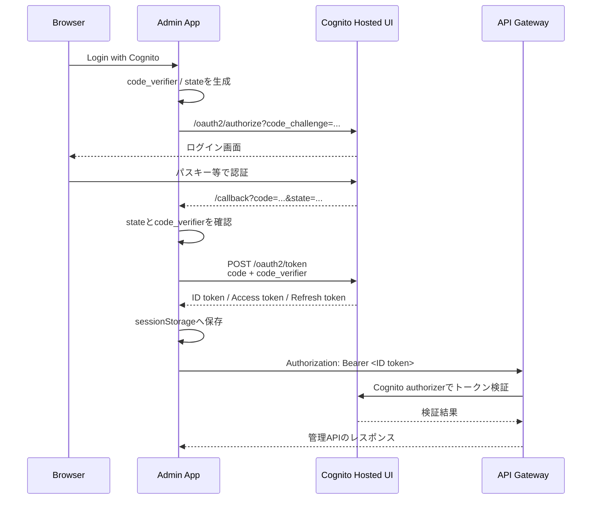

# kyo8-portfolio
ポートフォリオサイトです。公開サイトと管理画面を同一リポジトリで管理するモノレポ構成です。
※テストコード作成中です。

# 目次
- [リポジトリ構成](#リポジトリ構成)
- [AWSアーキテクチャ](#aws-アーキテクチャ)
- [Terraform](#terraform)
- [APIルーティング](#apiルーティング)
- [エラーハンドリング](#エラーハンドリング)
- [DynamoDB一覧取得](#dynamodb一覧取得)
- [Cognito認証フロー](#cognito-認証フロー)
- [デプロイ](#デプロイ)
- [バッチ同期](#バッチ同期)

# リポジトリ構成

`````text
kyo8-portfolio/
├── apps/
│   ├── web/       # 公開用 Next.js
│   ├── admin/     # 管理用 Next.js
│   └── api/       # Go API / Lambda
├── infra/
│   ├── stg/       # ステージング環境
│   ├── prd/       # 本番環境
│   └── modules/   # Terraformモジュール
└── .github/
    └── workflows/ # CI/CD
`````

`apps/web`と`apps/admin`はNext.jsのフロントエンドです。共通コンポーネントはnpm workspacesで管理しています。

`apps/api`はGoで書かれたAPIで、LambdaコンテナとしてECRにデプロイされます。

# AWSアーキテクチャ


# Terraform

環境ごとに`stg`と`prd`を分離し、TerraformのstateをS3バケットで環境別に管理します。

## 主な管理対象：

- ECR
- Lambda
- API Gateway
- DynamoDB
- Cognito 
- EventBridge Scheduler
- ACM certificates
- Route53

# APIルーティング
## Public API
```text
GET /{proxy+}
└── Lambda API
```
一般ユーザー向けのAPIは、`/{proxy+}`配下にまとめます。書き込み操作はありません。

## Admin API
```text
OPTIONS /admin/{proxy+} # CORS preflight、認証なし
POST   /admin/{proxy+}  # Cognito認証
PUT    /admin/{proxy+}  # Cognito認証
DELETE /admin/{proxy+}  # Cognito認証
```
管理APIは`/admin/{proxy+}`配下にまとめ、書き込み操作にCognito認証を要求します。OPTIONSリクエストはCORS preflight用で、認証なしで許可します。

# エラーハンドリング

アプリケーション固有のエラーは`apps/api/internal/apperrors`で管理します。エラーにはアプリケーション用のエラーコード、クライアント向けメッセージ、元のエラーを保持します。元のエラーは`json:"-"`によりHTTPレスポンスへ公開せず、`ErrorHandler`がエラーコード、HTTPメソッド、パス、ステータス、メッセージ、元エラーを構造化されたキー・バリュー形式でログに出力します。

エラー処理の責務は次のように分けています。

- Repository：DynamoDB SDKのエラーを`apperrors`へ変換する
- Service：Repositoryから返されたエラーをそのまま上位へ返す
- Handler：`apperrors.ErrorHandler`でHTTPステータスとJSONレスポンスへ変換する

Repositoryでは、DynamoDB固有のエラーとデータ変換エラーを分類します。共通の分類処理は`apps/api/internal/repository/dynamo_error.go`にあります。

主なエラーコード、発生条件、クライアントとCloudWatchに返す内容は次の通りです。クライアントには内部エラーの詳細を返さず、CloudWatchの`cause`に元エラーを記録します。

| コード | HTTPステータス | 発生例 | クライアント | CloudWatch |
| --- | --- | --- | --- | --- |
| `D001` DependencyUnavailable | 503 Service Unavailable | DynamoDB通信失敗、Zenn一時停止 | `DynamoDB is unavailable` / `Zenn RSS is unavailable` | `cause`に元エラー |
| `D002` DependencyAuthFailed | 500 Internal Server Error | AWS認証・権限エラー | `DynamoDB authentication failed` | `cause`にAWSエラー |
| `D003` DependencyConfigError | 500 Internal Server Error | DynamoDBテーブル不存在 | `DynamoDB table is not configured correctly` | `cause`に設定エラー |
| `D004` DependencyThrottled | 503 Service Unavailable | DynamoDBスロットリング、Zenn 429 | `... request was throttled` | `cause`にスロットリングエラー |
| `D005` Timeout | 504 Gateway Timeout | Zenn RSSタイムアウト | `Zenn RSS request timed out` | `cause`にタイムアウト |
| `D006` DataMappingFailed | 500 Internal Server Error | DynamoDB・RSSデータ変換失敗 | `failed to decode ... data` | `cause`に変換エラー |
| `D007` ExternalServiceFailed | 502 Bad Gateway | Zennの429以外の4xx、空RSS | `Zenn RSS request failed` | `cause`にZennのステータス |
| `R001` BadParam | 400 Bad Request | 必須ID・パラメータ不正 | `project id is required`など | `cause`に入力エラー |
| `R002` ReqBodyDecodeFailed | 400 Bad Request | 不正JSON、未知フィールド、複数JSON、後続の不正文字 | `Failed to decode request body` | `cause`にデコードエラー |
| `R003` ResponseEncodeFailed | 500 Internal Server Error | レスポンスのJSON変換失敗 | `Failed to encode response body` | `cause`にエンコードエラー |
| `R004` NotFound | 404 Not Found | 指定データ不存在 | `article not found`など | `cause`に不存在情報 |
| `R005` RequestBodyTooLarge | 400 Bad Request | ボディが1MiB超過 | `request body is too large` | `cause`にサイズ超過 |

内部のDynamoDBエラー詳細はレスポンスへ返さず、例えば次のようなアプリケーション用エラーを返します。

`````json
{
  "ErrCode": "D004",
  "Message": "DynamoDB request was throttled"
}
`````

入力検証は`internal/handler/decode.go`に共通化しています。リクエストボディのサイズを制限し、モデルに存在しないJSONフィールドを拒否します。また、1つのリクエストにJSONが複数含まれていたり、JSONの後ろに不正な文字が続いていたりする場合も入力エラーとして弾きます。

# Cognito認証フロー

管理画面は、ブラウザだけで完結するSPA向けAuthorization Code Flow with PKCEを使用します。Cognito App ClientにはClient Secretを設定しません。



実装上のポイント：

- 認可コードのトークン交換はブラウザからCognitoへ直接行う
- `code_verifier`はブラウザから送信し、PKCEで認可コードを保護する
- APIリクエストでは現在IDトークンを`Authorization`ヘッダーへ付与する
- トークンの保存先は`sessionStorage`
- Access tokenの期限切れ時はRefresh tokenで更新する
- `/admin/*`の書き込みはAPI GatewayのCognito User Pools authorizerで保護する

# デプロイ

## フロントエンド

`apps/web`と`apps/admin`はAWS Amplifyでデプロイします。Amplifyの環境変数にAPI URLやCognito設定を指定します。

## バックエンド

GitHub Actionsが`apps/api`をDocker buildし、ARM64用のLambdaコンテナイメージとしてECRへpushします。その後、API用とBatch用のLambda関数を同じイメージから更新します。


`apps/api/Dockerfile`では、APIとBatchの2つのGoバイナリを1つのコンテナイメージへ配置します。Lambdaごとに起動するコマンドを切り替えます。

```text
/var/task/api    # API Lambda
/var/task/batch  # Batch Lambda
```

# バッチ同期

EventBridge SchedulerがBatch Lambdaを定期実行し、ZennのRSSを取得して記事データをDynamoDBへ保存します。Batch LambdaはAPI Gatewayから公開するエンドポイントを持ちません。

`````mermaid
sequenceDiagram
    participant S as EventBridge Scheduler
    participant L as Lambda Batch
    participant Z as Zenn RSS
    participant D as DynamoDB

    S->>L: 定期的に起動
    L->>Z: RSSフィードを取得
    Z-->>L: 記事一覧・OGP画像URL
    L->>L: 記事データを変換
    L->>D: articleテーブルへ保存
    D-->>L: 保存結果
`````
