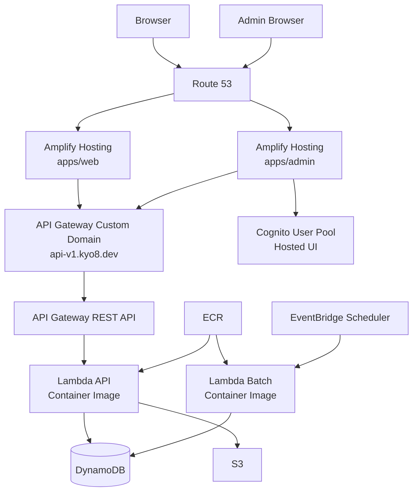
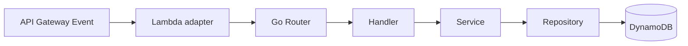
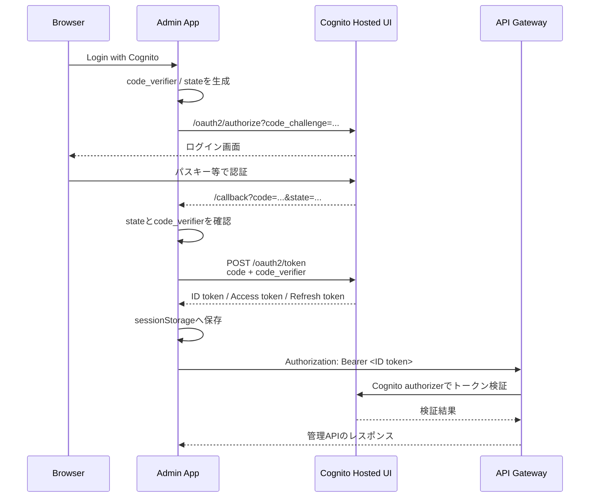
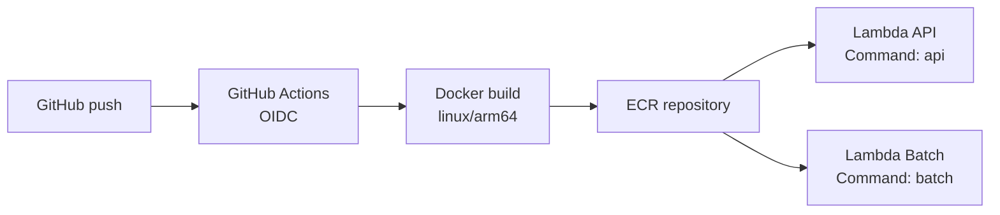

# kyo8-portfolio

Kyoyaのポートフォリオサイトです。公開サイトと管理画面を同一リポジトリで管理するモノレポ構成です。

## Repository structure

`````text
kyo8-portfolio/
├── apps/
│   ├── web/       # 公開用 Next.js
│   ├── admin/     # 管理用 Next.js
│   └── api/       # Go API / Lambda
├── infra/
│   ├── stg/       # Terraform staging root
│   ├── prd/       # Terraform production root
│   └── modules/   # Terraform modules
└── .github/
    └── workflows/ # CI/CD
`````

`apps/web`と`apps/admin`はnpm workspacesで管理し、`apps/api`は独立したGo Moduleです。

## AWS architecture



環境ごとに`stg`と`prd`を分離し、Terraformのstateも環境別に管理します。

## API routing

`````text
GET /{proxy+}
└── Lambda API

管理APIは`/admin/{proxy+}`配下にまとめ、書き込み操作にCognito認証を要求します。

POST   /admin/{proxy+}  # Cognito User Pools
PUT    /admin/{proxy+}  # Cognito User Pools
DELETE /admin/{proxy+}  # Cognito User Pools
OPTIONS /admin/{proxy+} # CORS preflight、認証なし
`````

Lambda内ではAPI GatewayのイベントをHTTPリクエストへ変換し、Goのrouterへ渡します。



## Cognito authentication flow

管理画面は、ブラウザだけで完結するSPA向けAuthorization Code Flow with PKCEを使用します。Cognito App ClientにはClient Secretを設定しません。



実装上のポイント：

- 認可コードのトークン交換はブラウザからCognitoへ直接行う
- `code_verifier`はブラウザから送信し、PKCEで認可コードを保護する
- APIリクエストでは現在IDトークンを`Authorization`ヘッダーへ付与する
- トークンの保存先は`sessionStorage`
- Access tokenの期限切れ時はRefresh tokenで更新する
- `/admin/*`の書き込みはAPI GatewayのCognito User Pools authorizerで保護する

## Deployment

### Frontend

`apps/web`と`apps/admin`はAWS Amplifyでデプロイします。Amplifyの環境変数にAPI URLやCognito設定を指定します。

### Backend

GitHub Actionsが`apps/api`をDocker buildし、ARM64用のLambdaコンテナイメージとしてECRへpushします。その後、API用とBatch用のLambda関数を同じイメージから更新します。



`apps/api/Dockerfile`では、APIとBatchの2つのGoバイナリを1つのコンテナイメージへ配置します。Lambdaごとに起動するコマンドを切り替えます。

```text
/var/task/api    # API Lambda
/var/task/batch  # Batch Lambda
```

### Batch synchronization

EventBridge SchedulerがBatch Lambdaを定期実行し、ZennのRSSを取得して記事データをDynamoDBへ保存します。Batch LambdaはAPI Gatewayから公開するエンドポイントを持ちません。

## Terraform

TerraformではAWSリソースの構成を管理します。DynamoDBのテーブル定義やIAM権限はTerraformで管理しますが、テーブル内のポートフォリオデータはアプリケーションデータのためTerraformの管理対象にはしません。

主な管理対象：

- ECR
- Lambda
- API Gateway REST API、リソース、メソッド、統合、ステージ、カスタムドメイン
- DynamoDB tables
- Cognito User Pool、App Client、User Pool Domain
- EventBridge Scheduler
- ACM certificates
- Route 53 hosted zone and records
- S3

## Local development

Go APIは`apps/api`で実行します。

`````bash
cd apps/api
go run ./cmd/server
`````

APIのヘルスチェック：

`````bash
curl -i http://localhost:8080/health
`````

テストとビルド：

`````bash
go test ./...
go build ./cmd/server
`````
