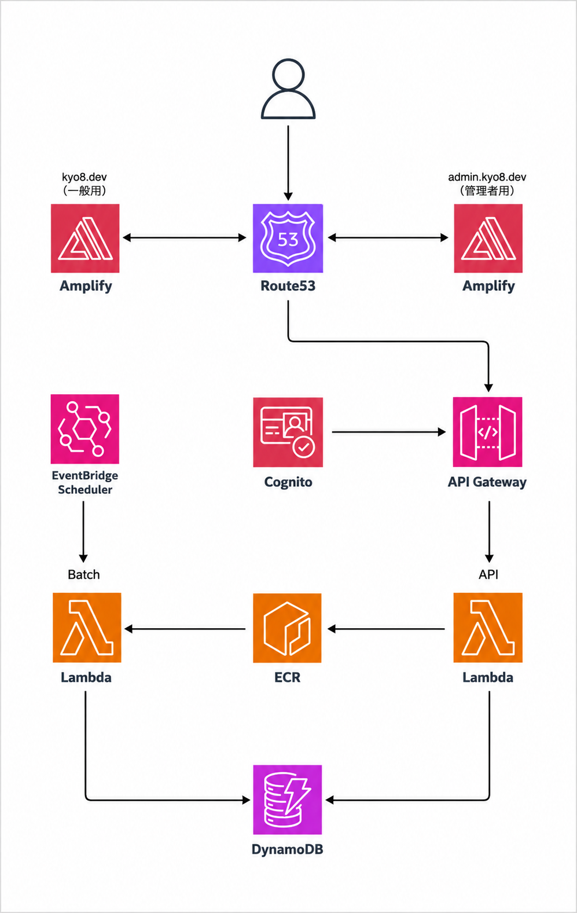
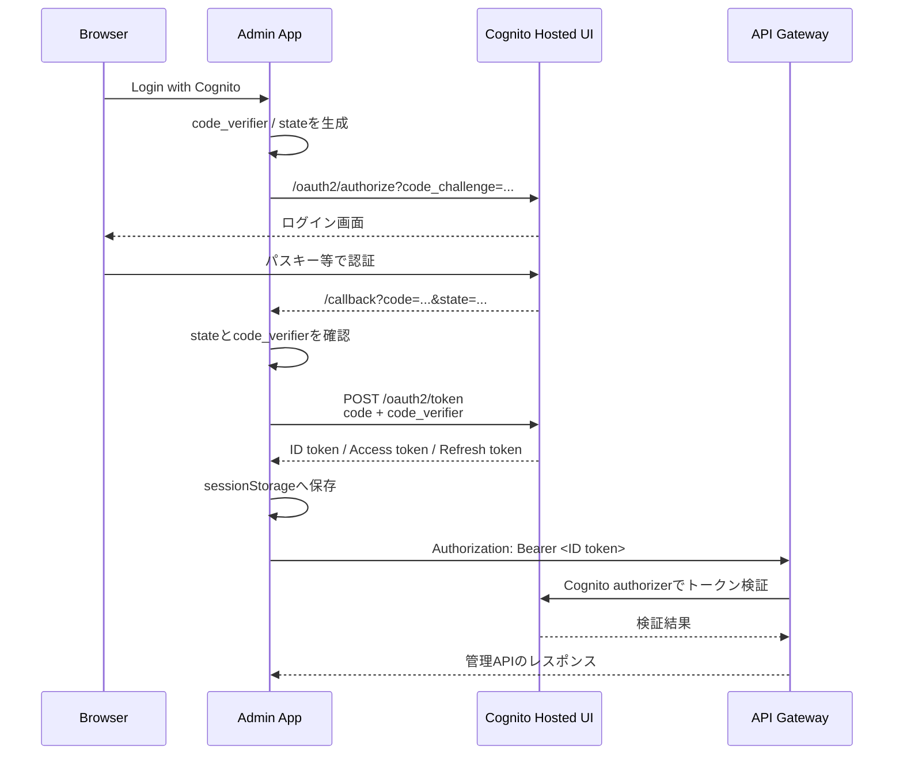

# kyo8-portfolio
ポートフォリオサイトです。公開サイトと管理画面を同一リポジトリで管理するモノレポ構成です。

# 目次
- [リポジトリ構成](#リポジトリ構成)
- [AWSアーキテクチャ](#aws-アーキテクチャ)
- [Terraform](#terraform)
- [APIルーティング](#apiルーティング)
- [エラーハンドリング](#エラーハンドリング)
- [Cognito認証フロー](#cognito-認証フロー)
- [デプロイ](#デプロイ)
- [バッチ同期](#バッチ同期)

# リポジトリ構成

`````text
kyo8-portfolio/
├── apps/
│   ├── web/       # 公開用 Next.js
│   ├── admin/     # 管理用 Next.js
│   └── api/       # Go API / Lambda
├── infra/
│   ├── stg/       # ステージング環境
│   ├── prd/       # 本番環境
│   └── modules/   # Terraformモジュール
└── .github/
    └── workflows/ # CI/CD
`````

`apps/web`と`apps/admin`はNext.jsのフロントエンドです。共通コンポーネントはnpm workspacesで管理しています。

`apps/api`はGoで書かれたAPIで、LambdaコンテナとしてECRにデプロイされます。

# AWSアーキテクチャ



# Terraform

環境ごとに`stg`と`prd`を分離し、TerraformのstateをS3バケットで環境別に管理します。

## 主な管理対象：

- ECR
- Lambda
- API Gateway
- DynamoDB
- Cognito 
- EventBridge Scheduler
- ACM certificates
- Route53

# APIルーティング
## Public API
```text
GET /{proxy+}
└── Lambda API
```
一般ユーザー向けのAPIは、`/{proxy+}`配下にまとめます。書き込み操作はありません。

## Admin API
```text
OPTIONS /admin/{proxy+} # CORS preflight、認証なし
POST   /admin/{proxy+}  # Cognito認証
PUT    /admin/{proxy+}  # Cognito認証
DELETE /admin/{proxy+}  # Cognito認証
```
管理APIは`/admin/{proxy+}`配下にまとめ、書き込み操作にCognito認証を要求します。OPTIONSリクエストはCORS preflight用で、認証なしで許可します。

# エラーハンドリング

アプリケーション固有のエラーは`apps/api/internal/apperrors`で管理します。エラーにはアプリケーション用のエラーコード、クライアント向けメッセージ、元のエラーを保持します。元のエラーは`json:"-"`によりHTTPレスポンスへ公開せず、`ErrorHandler`がエラーコード、HTTPメソッド、パス、ステータス、メッセージ、元エラーを構造化されたキー・バリュー形式でログに出力します。

エラー処理の責務は次のように分けています。

- Repository：DynamoDB SDKのエラーを`apperrors`へ変換する
- Service：Repositoryから返されたエラーをそのまま上位へ返す
- Handler：`apperrors.ErrorHandler`でHTTPステータスとJSONレスポンスへ変換する

Repositoryでは、DynamoDB固有のエラーとデータ変換エラーを分類します。共通の分類処理は`apps/api/internal/repository/dynamo_error.go`にあります。

主なエラーコードとHTTPステータスは次の通りです。

`````text
D001 DependencyUnavailable  503 Service Unavailable
D002 DependencyAuthFailed   500 Internal Server Error
D003 DependencyConfigError  500 Internal Server Error
D004 DependencyThrottled    503 Service Unavailable
D005 Timeout                504 Gateway Timeout
D006 DataMappingFailed      500 Internal Server Error
D007 ExternalServiceFailed  502 Bad Gateway
R001 BadParam              400 Bad Request
R002 ReqBodyDecodeFailed   400 Bad Request
R003 ResponseEncodeFailed  500 Internal Server Error
R004 NotFound              404 Not Found
`````

内部のDynamoDBエラー詳細はレスポンスへ返さず、例えば次のようなアプリケーション用エラーを返します。

`````json
{
  "ErrCode": "D004",
  "Message": "DynamoDB request was throttled"
}
`````

# Cognito認証フロー

管理画面は、ブラウザだけで完結するSPA向けAuthorization Code Flow with PKCEを使用します。Cognito App ClientにはClient Secretを設定しません。



実装上のポイント：

- 認可コードのトークン交換はブラウザからCognitoへ直接行う
- `code_verifier`はブラウザから送信し、PKCEで認可コードを保護する
- APIリクエストでは現在IDトークンを`Authorization`ヘッダーへ付与する
- トークンの保存先は`sessionStorage`
- Access tokenの期限切れ時はRefresh tokenで更新する
- `/admin/*`の書き込みはAPI GatewayのCognito User Pools authorizerで保護する

# デプロイ

## フロントエンド

`apps/web`と`apps/admin`はAWS Amplifyでデプロイします。Amplifyの環境変数にAPI URLやCognito設定を指定します。

## バックエンド

GitHub Actionsが`apps/api`をDocker buildし、ARM64用のLambdaコンテナイメージとしてECRへpushします。その後、API用とBatch用のLambda関数を同じイメージから更新します。


`apps/api/Dockerfile`では、APIとBatchの2つのGoバイナリを1つのコンテナイメージへ配置します。Lambdaごとに起動するコマンドを切り替えます。

```text
/var/task/api    # API Lambda
/var/task/batch  # Batch Lambda
```

# バッチ同期

EventBridge SchedulerがBatch Lambdaを定期実行し、ZennのRSSを取得して記事データをDynamoDBへ保存します。Batch LambdaはAPI Gatewayから公開するエンドポイントを持ちません。

`````mermaid
sequenceDiagram
    participant S as EventBridge Scheduler
    participant L as Lambda Batch
    participant Z as Zenn RSS
    participant D as DynamoDB

    S->>L: 定期的に起動
    L->>Z: RSSフィードを取得
    Z-->>L: 記事一覧・OGP画像URL
    L->>L: 記事データを変換
    L->>D: articleテーブルへ保存
    D-->>L: 保存結果
`````
