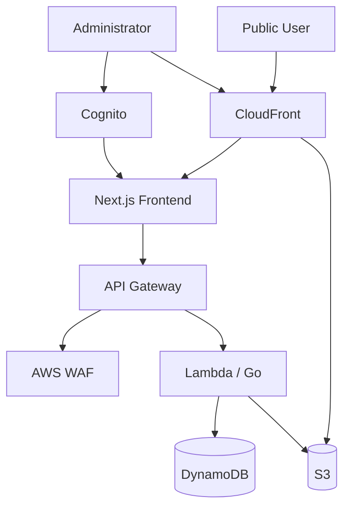
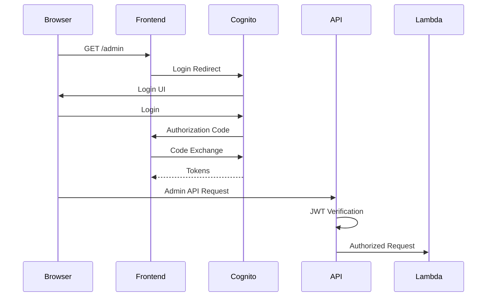
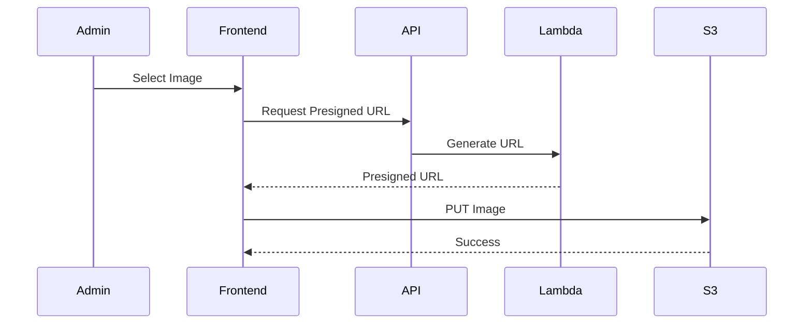

# kyo8.dev Portfolio — 要件定義書

## 1. プロジェクト概要

本プロジェクトは、エンジニアとしての経歴・スキル・制作物を公開するポートフォリオサイトである。

単なる静的ポートフォリオではなく、管理者本人が管理画面からコンテンツを更新できる構成とし、Frontend / Backend / AWS Infrastructure / Authentication / CI/CD を一つのプロジェクトとして構築する。

また、本プロジェクト自体を以下の技術領域の成果物として扱う。

* Next.jsを利用したFrontend開発
* Goを利用したBackend API開発
* AWSによるクラウドインフラ設計
* Cognitoを利用した認証・認可
* DynamoDBを利用したデータ管理
* S3 / CloudFrontを利用したコンテンツ配信
* AWS WAFによるWebセキュリティ
* TerraformによるInfrastructure as Code
* GitHub ActionsによるCI/CD
* AWS Organizationsによるstg / prd環境分離

---

# 2. システムの目的

本システムでは以下を実現する。

### 公開ユーザー

認証せずに以下を閲覧できる。

* Profile
* Career
* Skills
* Projects
* Project詳細
* GitHub等の外部リンク

### 管理者

管理者本人のみCognitoで認証し、以下を操作できる。

* Profile編集
* Career CRUD
* Skills CRUD
* Projects CRUD
* Project公開 / 非公開切り替え
* Project画像アップロード

---

# 3. ドメイン構成

## Production

| 用途          | URL                      |
| ----------- | ------------------------ |
| 公開Frontend  | `https://kyo8.dev`       |
| Backend API | `https://api.kyo8.dev`   |
| 管理画面        | `https://kyo8.dev/admin` |

管理画面は公開Frontendと同一Next.jsアプリケーション内に実装する。

公開ページから `/admin` へのリンク・ボタンは設置しない。

URLそのものを秘匿することはセキュリティ対策とはみなさず、管理機能へのアクセス制御はCognitoおよびBackend API側で行う。

## Staging

| 用途          | URL                          |
| ----------- | ---------------------------- |
| Frontend    | `https://stg.kyo8.dev`       |
| Backend API | `https://api.stg.kyo8.dev`   |
| 管理画面        | `https://stg.kyo8.dev/admin` |

---

# 4. AWS Organizations構成

AWS Organizationsを利用してProductionとStagingをAWS Account単位で分離する。

```text
AWS Organization
│
├── Management Account
│
└── Workloads OU
    │
    └── portfolio OU
        │
        ├── portfolio-stg
        │
        └── portfolio-prd
```

各AWS Accountをセキュリティ・権限・障害・課金の分離境界として扱う。

Management Accountには原則としてアプリケーションワークロードを配置しない。

---

# 5. リポジトリ構成

Frontend / Backend / Infrastructureは一つのGitHub Repositoryで管理する。

```text
portfolio/
│
├── frontend/
│   ├── app/
│   ├── components/
│   ├── lib/
│   ├── types/
│   ├── public/
│   └── package.json
│
├── backend/
│   ├── cmd/
│   ├── internal/
│   ├── go.mod
│   └── go.sum
│
├── infra/
│   ├── modules/
│   └── envs/
│       ├── stg/
│       └── prd/
│
├── docs/
│
├── .github/
│   └── workflows/
│
├── REQUIREMENTS.md
└── README.md
```

本ファイル `REQUIREMENTS.md` をシステム全体の仕様のSource of Truthとして扱う。

実装中に仕様変更が発生した場合は、可能な限り実装と同じPull Requestで本ファイルも更新する。

---

# 6. システムアーキテクチャ



実際のAWSサービス接続順序についてはTerraform実装時にAWS仕様に合わせて調整する。

この図は論理アーキテクチャを表す。

---

# 7. Frontend要件

## 7.1 使用技術

* TypeScript
* React
* Next.js
* App Router

FrontendからBackendへHTTP APIでアクセスする。

Backend API URLは環境変数によってstg / prdを切り替える。

例：

```text
NEXT_PUBLIC_API_BASE_URL=https://api.kyo8.dev
```

---

# 8. 公開ページ

最低限以下のページを実装する。

## Home

`/`

概要を表示する。

表示候補：

* 名前
* エンジニアとしてのHeadline
* About概要
* Featured Projects
* Skills概要
* GitHubリンク

---

## About

`/about`

詳細プロフィールを表示する。

---

## Projects

`/projects`

制作物一覧を表示する。

公開状態 `published = true` のProjectのみ表示する。

---

## Project Detail

`/projects/[slug]`

個別Projectの詳細を表示する。

表示内容：

* Title
* Summary
* Description
* Thumbnail
* Technologies
* GitHub Repository
* Website
* その他Project固有情報

---

## Career

`/career`

以下を時系列で表示する。

* Work
* Internship
* Education

---

## Skills

`/skills`

技術スタックをカテゴリ別に表示する。

カテゴリ例：

* Frontend
* Backend
* Infrastructure
* Database
* Blockchain
* Tools

---

# 9. 管理画面

管理画面は公開Frontendと同じNext.js Application内に実装する。

```text
/admin
/admin/projects
/admin/projects/new
/admin/projects/[id]
/admin/profile
/admin/skills
/admin/careers
```

公開ページ上には管理画面への導線を表示しない。

---

# 10. 管理画面認証

`/admin` へのアクセス時に認証状態を確認する。

未認証の場合はCognitoへリダイレクトする。

認証にはOAuth 2.0 Authorization Code Flowを利用する。

想定フロー：



管理画面を表示できることと、管理APIを利用できることは別のセキュリティ境界として扱う。

Frontendの認証判定だけには依存しない。

---

# 11. Backend要件

## 使用技術

* Go
* AWS Lambda
* Amazon API Gateway
* Amazon DynamoDB
* Amazon Cognito
* Amazon S3

BackendはREST APIとして実装する。

Base URL：

```text
https://api.kyo8.dev/v1
```

---

# 12. API設計方針

APIを以下の2種類に分類する。

### Public API

認証不要。

読み取り専用。

### Admin API

Cognito認証必須。

作成・更新・削除を許可する。

```text
/v1/*
      Public API

/v1/admin/*
      Admin API
```

---

# 13. Public API

## Profile

```http
GET /v1/profile
```

---

## Projects

```http
GET /v1/projects
GET /v1/projects/{slug}
```

`published = true` のProjectのみPublic APIから取得可能とする。

---

## Skills

```http
GET /v1/skills
```

---

## Careers

```http
GET /v1/careers
```

---

# 14. Admin API

## Projects

```http
GET    /v1/admin/projects
POST   /v1/admin/projects
GET    /v1/admin/projects/{id}
PUT    /v1/admin/projects/{id}
DELETE /v1/admin/projects/{id}
```

---

## Profile

```http
GET /v1/admin/profile
PUT /v1/admin/profile
```

---

## Skills

```http
GET    /v1/admin/skills
POST   /v1/admin/skills
PUT    /v1/admin/skills/{id}
DELETE /v1/admin/skills/{id}
```

---

## Careers

```http
GET    /v1/admin/careers
POST   /v1/admin/careers
PUT    /v1/admin/careers/{id}
DELETE /v1/admin/careers/{id}
```

---

# 15. Projectデータモデル

```json
{
  "id": "01J...",
  "slug": "portfolio-site",
  "title": "Portfolio Site",
  "summary": "AWS上に構築したポートフォリオサイト",
  "description": "Project detail",
  "thumbnailUrl": "https://...",
  "repositoryUrl": "https://github.com/...",
  "websiteUrl": "https://...",
  "technologies": [
    "Go",
    "Next.js",
    "AWS",
    "Terraform"
  ],
  "featured": true,
  "published": true,
  "order": 1,
  "createdAt": "2026-08-19T09:00:00Z",
  "updatedAt": "2026-08-19T09:00:00Z"
}
```

---

# 16. Profileデータモデル

```json
{
  "name": "Ryota Kyoya",
  "headline": "Backend / Infrastructure Engineer",
  "bio": "...",
  "githubUrl": "https://github.com/...",
  "xUrl": null
}
```

---

# 17. Skillデータモデル

```json
{
  "id": "01J...",
  "name": "Go",
  "category": "backend",
  "order": 1
}
```

Category：

```text
frontend
backend
infrastructure
database
blockchain
tools
```

---

# 18. Careerデータモデル

```json
{
  "id": "01J...",
  "type": "work",
  "organization": "Example Inc.",
  "position": "Backend Engineer",
  "startDate": "2025-01",
  "endDate": "2026-01",
  "description": "...",
  "order": 1
}
```

Type：

```text
work
internship
education
```

---

# 19. DynamoDB要件

DBにはAmazon DynamoDBを利用する。

初期段階ではアクセスパターンを限定する。

必要なアクセスパターン：

* Profile取得
* Project一覧取得
* Project ID取得
* Project slug取得
* Skill一覧取得
* Career一覧取得
* 各データのCRUD

テーブル設計についてはBackend実装時にアクセスパターンから決定する。

単一テーブル設計を採用すること自体を目的としない。

シンプルな複数テーブル構成の方が妥当であればそちらを採用する。

---

# 20. 画像アップロード

画像ファイルはLambda経由でアップロードしない。

管理画面からS3へ直接アップロードする。

フロー：



API：

```http
POST /v1/admin/uploads
```

Request：

```json
{
  "fileName": "portfolio.png",
  "contentType": "image/png"
}
```

Response：

```json
{
  "uploadUrl": "https://...",
  "objectKey": "projects/...",
  "publicUrl": "https://..."
}
```

---

# 21. Backendアーキテクチャ

GoコードはHTTP / Application Logic / Persistenceを明確に分離する。

例：

```text
backend/
├── cmd/
│   └── api/
│
└── internal/
    ├── handler/
    ├── service/
    ├── repository/
    ├── domain/
    └── infrastructure/
```

ただし、レイヤー分離自体を目的化せず、システム規模に応じて過剰な抽象化を避ける。

---

# 22. Error Response

APIのエラー形式を統一する。

```json
{
  "error": {
    "code": "PROJECT_NOT_FOUND",
    "message": "Project was not found"
  }
}
```

---

# 23. HTTP Status Code

| Status | 用途                    |
| ------ | --------------------- |
| 200    | 成功                    |
| 201    | Resource作成成功          |
| 204    | Resource削除成功          |
| 400    | Request不正             |
| 401    | 未認証                   |
| 403    | 権限不足                  |
| 404    | Resourceなし            |
| 409    | Conflict              |
| 429    | Rate Limit            |
| 500    | Internal Server Error |

---

# 24. Infrastructure要件

InfrastructureはTerraformで管理する。

対象：

* Route 53
* ACM
* CloudFront
* S3
* WAF
* API Gateway
* Lambda
* DynamoDB
* Cognito
* IAM
* CloudWatch

必要に応じて追加する。

---

# 25. Terraform構成

```text
infra/
│
├── modules/
│   ├── frontend/
│   ├── api/
│   ├── database/
│   ├── cognito/
│   ├── waf/
│   └── monitoring/
│
└── envs/
    │
    ├── stg/
    │   ├── main.tf
    │   ├── variables.tf
    │   ├── outputs.tf
    │   └── backend.tf
    │
    └── prd/
        ├── main.tf
        ├── variables.tf
        ├── outputs.tf
        └── backend.tf
```

Terraform Moduleはstg / prdで共通利用する。

環境ごとの差分はvariablesで表現する。

---

# 26. Terraform State

Terraform StateをGit Repositoryには保存しない。

Remote Backendを利用する。

想定：

* S3
* State Encryption
* State Locking

stg / prdでStateを分離する。

---

# 27. AWS IAM

Least Privilegeを基本方針とする。

Lambdaごとに必要なIAM Permissionのみ付与する。

例：

Project Lambda：

```text
dynamodb:GetItem
dynamodb:PutItem
dynamodb:UpdateItem
dynamodb:DeleteItem
dynamodb:Query
```

Upload URL発行Lambda：

```text
s3:PutObject
```

GitHub ActionsからAWSへアクセスする場合、長期Access Keyを保存せずOIDC Federationを利用する。

---

# 28. Cognito要件

Amazon Cognito User Poolを利用する。

一般ユーザー向けUser Registrationは提供しない。

管理者本人のみ利用する。

利用目的：

* 管理画面ログイン
* Admin API認証

Authentication：

```text
OAuth 2.0 Authorization Code Flow
```

Admin APIではJWTを検証する。

---

# 29. Security要件

最低限以下を実施する。

### Authentication

* Cognito
* JWT validation

### Authorization

* `/v1/admin/*` は管理者のみ利用可能

### Network / HTTP

* HTTPSのみ
* ACM Certificate
* HTTP → HTTPS Redirect

### AWS WAF

FrontendおよびAPIに必要に応じて適用する。

検討対象：

* AWS Managed Rules
* IP Reputation
* Rate Based Rule

---

# 30. 管理画面IP制限

Cognito認証を主たるアクセス制御とする。

IP Allowlistは必須要件としない。

理由：

* 自宅回線のGlobal IP変更
* Mobile Network
* 外出先
* VPN

などによって管理者本人がアクセス不能になる可能性があるため。

必要になった場合には追加Defense in DepthとしてWAF IP Setを利用する。

---

# 31. CORS

FrontendとAPIのOriginが異なるためCORSを設定する。

Production：

```text
https://kyo8.dev
```

Staging：

```text
https://stg.kyo8.dev
```

任意のOriginからのAdmin APIアクセスは許可しない。

---

# 32. Logging

最低限以下をCloudWatch Logsへ記録する。

* Lambda Error
* API Error
* Authentication failure
* Backend内部エラー

機密情報はログに記録しない。

禁止例：

* Password
* Access Token
* Refresh Token
* ID Token
* Authorization Header
* Cookie
* Secret

---

# 33. Monitoring

最低限監視対象とする。

* Lambda Errors
* Lambda Duration
* API Gateway 4xx
* API Gateway 5xx
* API Gateway latency
* DynamoDB errors
* WAF blocked requests

個人ポートフォリオのため、初期段階では高度なObservability基盤は構築しない。

---

# 34. CI要件

GitHub Actionsを利用する。

Pull Request時：

Frontend：

```text
lint
typecheck
test
build
```

Backend：

```text
go fmt
go vet
go test
go build
```

Infrastructure：

```text
terraform fmt -check
terraform validate
terraform plan
```

---

# 35. CD要件

基本方針：

```text
feature branch
      ↓
Pull Request
      ↓
CI
      ↓
main merge
      ↓
stg deploy
      ↓
verification
      ↓
prd deploy
```

Productionへの自動デプロイ方式については実装段階で決定する。

Production Terraform Applyについては誤操作リスクを考慮し、初期段階ではManual Approvalを検討する。

---

# 36. GitHub Actions認証

AWS Access Key / Secret Access KeyをGitHub Secretsへ保存する方式は使用しない。

GitHub Actions OIDCを利用する。

```text
GitHub Actions
      ↓
OIDC
      ↓
AWS IAM Role
      ↓
AssumeRole
      ↓
AWS Deployment
```

stg / prdごとに異なるIAM Roleを利用する。

---

# 37. 環境分離

ProductionとStagingを以下の単位で分離する。

* AWS Account
* Domain
* Cognito
* DynamoDB
* Lambda
* API Gateway
* S3
* CloudFront
* Terraform State
* IAM Role

---

# 38. Environment Variables

環境固有情報はコードへ直接埋め込まない。

Frontend例：

```text
NEXT_PUBLIC_API_BASE_URL
NEXT_PUBLIC_COGNITO_DOMAIN
NEXT_PUBLIC_COGNITO_CLIENT_ID
```

Backend例：

```text
DYNAMODB_TABLE_NAME
UPLOAD_BUCKET_NAME
COGNITO_USER_POOL_ID
```

SecretはGitへcommitしない。

---

# 39. 非機能要件

## Performance

個人ポートフォリオのため極端な高負荷を想定しない。

静的コンテンツは可能な限りCloudFrontから配信する。

---

## Availability

AWS Managed Service / Serverless Serviceを中心に利用する。

Multi-AZサーバ構築などは行わない。

---

## Scalability

Lambda / DynamoDB等のServerless Serviceによって、アクセス増加時に手動サーバスケールを必要としない構成とする。

---

## Cost

個人開発のためコストを重要要件とする。

常時稼働EC2 / ECS / RDS等は初期構成では使用しない。

可能な限り、

* Lambda
* DynamoDB
* S3
* CloudFront

等の従量課金サービスを利用する。

---

# 40. 初期MVPでは実装しないもの

以下は初期リリース対象外とする。

* 一般ユーザーRegistration
* 一般ユーザーLogin
* Comment
* Like
* Follow
* Notification
* Full Text Search
* WebSocket
* GraphQL
* ECS
* EKS
* RDS
* Redis
* OpenSearch
* 複数管理者
* RBAC
* Multi Region
* Blue / Green Deployment

必要性が発生してから導入する。

---

# 41. MVP完成条件

## Frontend

* `kyo8.dev` が表示できる
* Profileを表示できる
* Projects一覧を表示できる
* Project詳細を表示できる
* Skillsを表示できる
* Careerを表示できる
* Responsive対応されている

## Admin

* `/admin` へアクセスできる
* Cognitoでログインできる
* 未認証ユーザーを拒否できる
* Project CRUDができる
* Profile更新ができる
* Skills CRUDができる
* Career CRUDができる
* S3へ画像アップロードできる

## Backend

* Public APIが利用できる
* Admin APIが認証されている
* DynamoDBへCRUDできる
* 適切なHTTP Statusを返す
* Error formatが統一されている

## Infrastructure

* stg / prdが別AWS Accountに存在する
* Route 53で名前解決できる
* HTTPSでアクセスできる
* CloudFront経由でFrontendを配信できる
* API GatewayからLambdaを実行できる
* Cognito認証が機能する
* DynamoDBを利用できる
* WAFが適用されている
* Terraformから再現可能である

## CI/CD

* Pull RequestでCIが実行される
* GitHub Actions OIDCでAWS認証できる
* stgへデプロイできる
* prdへ安全にデプロイできる

---

# 42. 実装順序

初期実装は以下の順序を基本とする。

```text
1. Frontend UI
       ↓
2. TypeScript Data Model
       ↓
3. Mock Data
       ↓
4. Frontend API Client
       ↓
5. Go API
       ↓
6. DynamoDB
       ↓
7. Cognito
       ↓
8. Admin UI
       ↓
9. S3 Upload
       ↓
10. AWS Infrastructure
       ↓
11. Terraform化
       ↓
12. CI/CD
       ↓
13. WAF / Monitoring
```

ただしTerraform導入時に既存AWS Resourceを手動構築している場合は、Resourceの再作成ではなくImportまたは構成の見直しを行う。

---

# 43. 設計原則

本プロジェクトでは以下を重視する。

### Simple First

技術を使うこと自体を目的にしない。

必要な問題に対して必要な技術だけを導入する。

### Explicit Boundaries

Frontend / Backend / Infrastructure / Authenticationの責務を明確にする。

### Security on Backend

Frontendの表示制御をセキュリティ境界として信用しない。

重要なAuthorizationはBackend側で必ず実施する。

### Infrastructure as Code

最終的なAWS InfrastructureはTerraformから再現可能にする。

### Environment Isolation

stgとprdをAWS Account単位で分離する。

### Cost Awareness

個人サービスであることを考慮し、不要な常時稼働Resourceを持たない。

### Avoid Resume-Driven Development

「ポートフォリオで見栄えがするから」という理由だけで技術を追加しない。

利用技術について、

「なぜこの技術が必要なのか」

を説明できる状態を維持する。

---

# 44. 最終構成

```text
GitHub
└── portfolio
    ├── frontend
    ├── backend
    └── infra
          │
          │ GitHub Actions + OIDC
          ↓

AWS Organizations
└── Workloads
    └── portfolio
        │
        ├── portfolio-stg
        │   ├── stg.kyo8.dev
        │   ├── api.stg.kyo8.dev
        │   ├── CloudFront
        │   ├── S3
        │   ├── WAF
        │   ├── Cognito
        │   ├── API Gateway
        │   ├── Lambda / Go
        │   └── DynamoDB
        │
        └── portfolio-prd
            ├── kyo8.dev
            ├── api.kyo8.dev
            ├── CloudFront
            ├── S3
            ├── WAF
            ├── Cognito
            ├── API Gateway
            ├── Lambda / Go
            └── DynamoDB
```

この構成を初期アーキテクチャとして実装を開始する。
